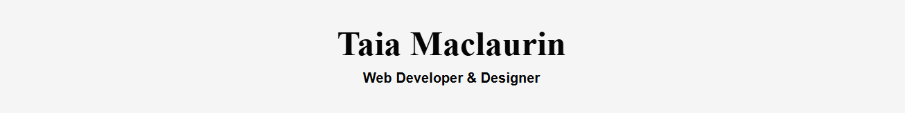

# Taia Maclaurin’s Portfolio Design System Documentation  

This documentation provides a clear and simplified overview of the design system used for the portfolio project. It includes colors, typography, components, and layouts. 

---

## 1. Color Palette  

- primary-color: rgb(16, 6, 15);
- text-color: #050505ff;
- border-color: #090808ff;
- background-color: #FFFFFF;
- secondary-bg: #F5F5F5;
- accent-color: #f0acc3ff;

## 2. Typography  

- **Headers (H1, H2, H3):** "Times New Roman", Times serif  
- **Body Text:** "Roboto", sans-serif  
- **Fallbacks:** Arial, Helvetica, sans-serif  
- **Special Text:** Bold used for navigation links and header tagline   

## 3. Components and Layout  
### Header  
- Background: Secondary background (#F5F5F5)  
- Title: Large serif font, centered  
- Subtitle: Bold tagline under title

### Navigation  
- Background: Dark grey (#333333)  
- Links: White text, bold,
- Hover effect: Accent underline (#f0acc3ff)

### About Section
- Layout: Profile picture + about text side by side  
- Profile picture: Circle (150x170px), black border  
- Text: Simple paragraph with heading  

### Project Cards
- Layout: Image + Title + Description  
- Image: 300px wide, rounded corners, drop shadow  
- Card: Thin border (#ddd), centered text, padding for spacing  

### Footer
- Background: Secondary background (#F5F5F5)  
- Text: Small, centered, light style   
- Design: Centered text, small font size, light grey (`#F5F5F5`) background
 

